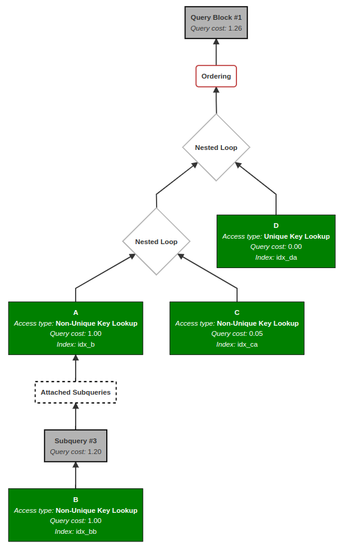

# MySQL Explain Visualization


Turn MySQL Explain JSON into vector UML sequence diagrams

[https://tailtq.github.io/mysql-explain-visualization](https://tailtq.github.io/mysql-explain-visualization)


## Example
---
We can turn
```json
{
  "query_block": {
    "select_id": 1,
    "cost_info": {
      "query_cost": "5935.00"
    },
    "table": {
      "table_name": "ABC",
      "access_type": "index",
      "key": "BCD_is_valid_139e97715daf4370_uniq",
      "used_key_parts": [
        "is_valid"
      ],
      "key_length": "1",
      "rows_examined_per_scan": 25990,
      "rows_produced_per_join": 25990,
      "filtered": "100.00",
      "using_index": true,
      "cost_info": {
        "read_cost": "737.00",
        "eval_cost": "5198.00",
        "prefix_cost": "5935.00",
        "data_read_per_join": "811M"
      }
    }
  }
}
```

into




## Thanks
---
Heavily inspired by [Workbench](https://www.mysql.com/products/workbench/) and [js-sequence-diagrams](https://bramp.github.io/js-sequence-diagrams/).
